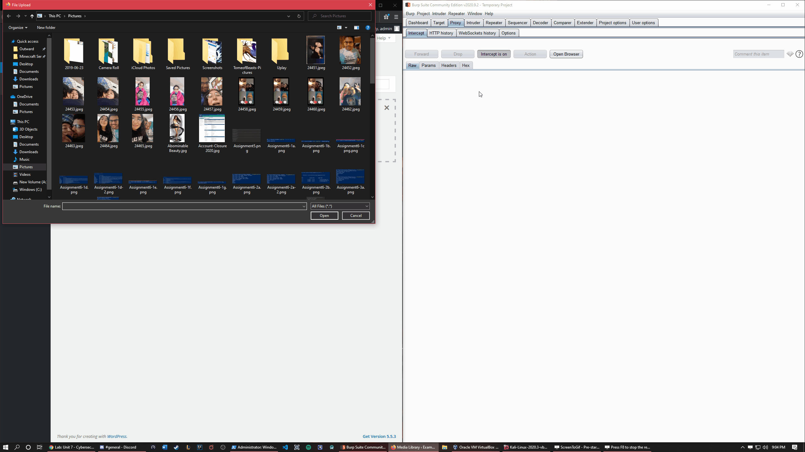
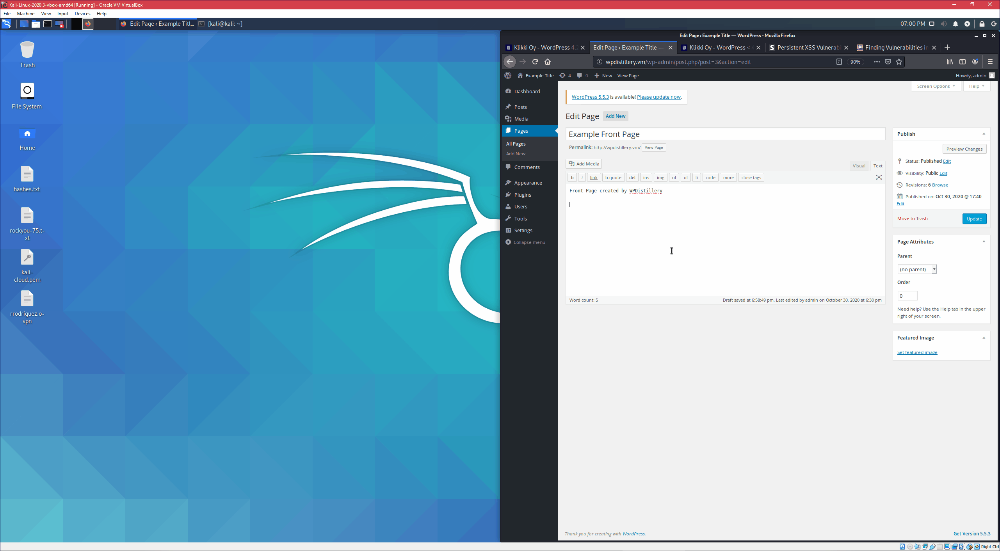
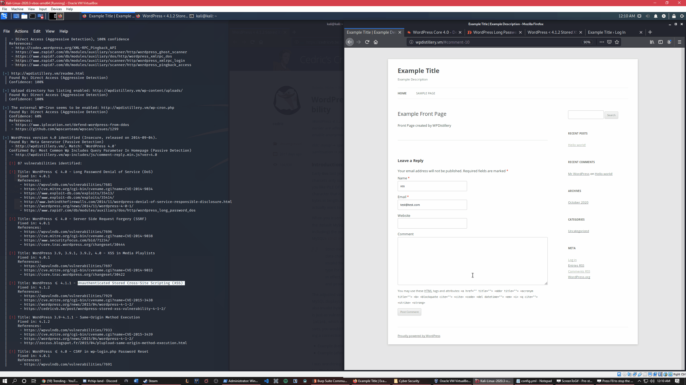
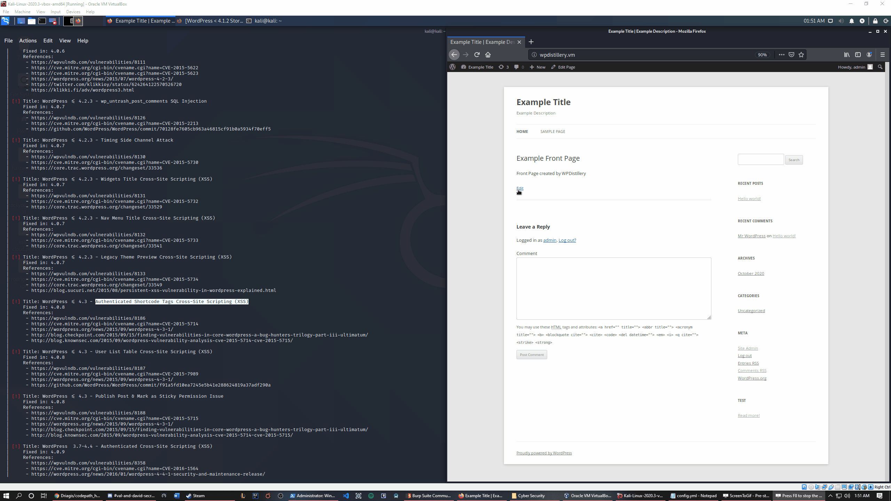
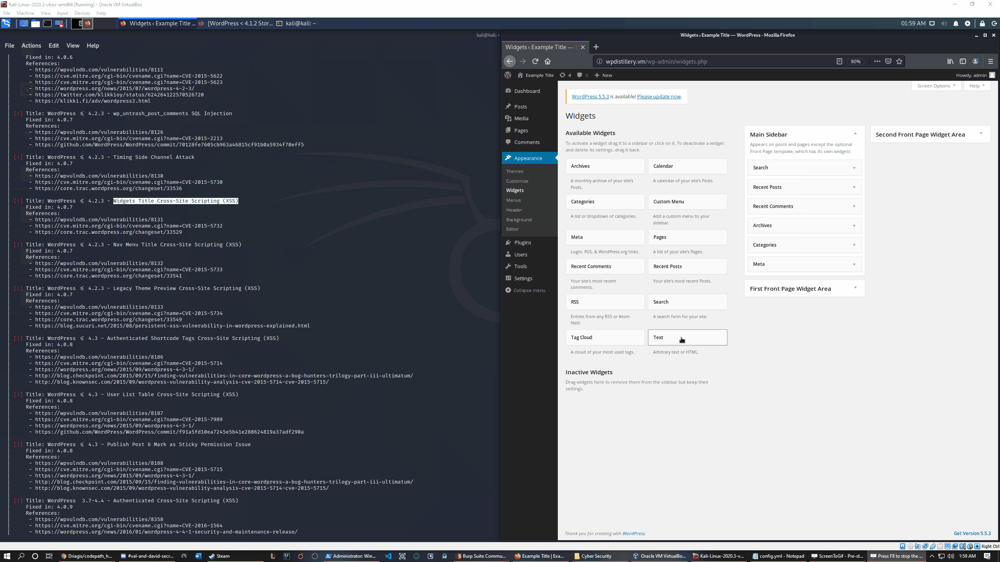
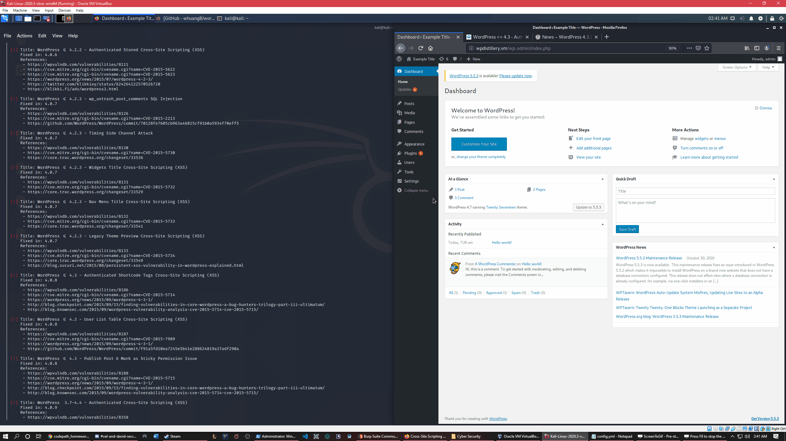

#1 Title: WordPress 2.5-4.6 - Authenticated Stored Cross-Site Scripting via Image Filename
-
This is the one we tested in the Lab of unit 7  
Summary : Cross-site scripting (XSS) vulnerability in the media_handle_upload function in wp-admin/includes/media.php in WordPress before 4.6.1 might allow remote attackers to inject arbitrary web script or HTML by tricking an administrator into uploading an image file that has a crafted filename.  
Vulnerability type:XSS   
CVE-ID: CVE-2016-7168  
Version: Tested in Wordpress version 4.2  
Fixed in: 4.6.1   

[x]Turn on intercept in Burp  
[x]Upload new media  
[x]Catch in Burp and change file name to one with XSS inside  
[x]Once it's been uploaded to the website view image page  
[x]XSS will be executed.  

 Affected code:<a href="https://github.com/WordPress/WordPress/commit/c9e60dab176635d4bfaaf431c0ea891e4726d6e0">Source Code</a>  
#2 Title: WordPress <= 4.2.2 - Authenticated Stored Cross-Site Scripting (XSS)
-
Tested in Wordpress version 4.2
Summary : WordPress before 4.2.3 does not properly verify the edit_posts capability, which allows remote authenticated users to bypass intended access restrictions and create drafts by leveraging the Subscriber role, as demonstrated by a post-quickdraft-save action to wp-admin/post.php.  
Vulnerability type:XSS   
CVE-ID: CVE-2015-5623  
Version: Tested in Wordpress version 4.2  
Fixed in: 4.2.3   

[x]Head to the pages tab  
[x]Edit the page's text instead of the visual part.  
[x] Update the page 
[x]Load the page that was edited  
[x]Once the action is done the script will execute. (This one used on onmouseover)  

#3 Title: WordPress <= 4.1.1 - Unauthenticated Stored Cross-Site Scripting (XSS)
-
Summary : Multiple cross-site scripting (XSS) vulnerabilities in WordPress before 4.1.2, when MySQL is used without strict mode, allow remote attackers to inject arbitrary web script or HTML via a (1) four-byte UTF-8 character or (2) invalid character that reaches the database layer, as demonstrated by a crafted character in a comment.  
Vulnerability type:XSS   
CVE-ID: CVE-2015-3438  
Version: Tested in Wordpress version 4.0  
Fixed in: 4.1.2  
In this one there was 2 ways to do it. After not being able to get the first way to wrok properly I then tried the second way. Which inserts the script into the content of the comments instead of the author line. Both ways could be shown here https://cedricvb.be/post/wordpress-stored-xss-vulnerability-4-1-2/

[x]Load up http://wpdistillery.vm/ without logging in  
[x] Enter the required information into the fields  
[x] Inside the comment content add some random text and create a new line (press enter) insert the script inside a block qoute with the crafter character 
[x] submit the comment 
[x] Once the action is done the script will run. (this one used onmouseover)  

#4 Title: WordPress <= 4.3 - Authenticated Shortcode Tags Cross-Site Scripting (XSS)
-
Summary : Cross-site scripting (XSS) vulnerability in WordPress before 4.3.1 allows remote attackers to inject arbitrary web script or HTML by leveraging the mishandling of unclosed HTML elements during processing of shortcode tags.  
Vulnerability type:XSS   
CVE-ID: CVE-2015-5714  
Version: Tested in Wordpress version 4.0  
Fixed in: 4.3.1   

[x]Head to the pages/posts tab  
[x]Create a new page/post or edit an existing page/post  
[x]Insert the shortcode with script inside  
[x]Load affected page/post 
[x]Script will be executed depending on the script (this one works on load)  
 Affected code:<a href="https://github.com/WordPress/WordPress/commit/f72b21af23da6b6d54208e5c1d65ececdaa109c8">Source Code</a>  

#5 Title: WordPress <= 4.2.3 - Widgets Title Cross-Site Scripting (XSS)
-
Summary: Cross-site scripting (XSS) vulnerability in the form function in the WP_Nav_Menu_Widget class in wp-includes/default-widgets.php in WordPress before 4.2.4 allows remote attackers to inject arbitrary web script or HTML via a widget title.   
Vulnerability type: XSS   
CVE-ID: CVE-2015-5732  
Version: Tested in Wordpress version 4.0  
Fixed in: 4.2.4   

[x]Head to appearcnce tab and select widget  
[x]Add a text widget  
[x]Add anything into the title  
[x]Write script into the paragraph of the widget  
[x]Load page and the script executes  
 Affected code:<a href="https://core.trac.wordpress.org/changeset/33529">Source Code</a>  

#6 Title: WordPress 2.9-4.7 - Authenticated Cross-Site scripting (XSS) in update-core.php
-
Summary : Multiple cross-site scripting (XSS) vulnerabilities in wp-admin/update-core.php in WordPress before 4.7.1 allow remote attackers to inject arbitrary web script or HTML via the (1) name or (2) version header of a plugin.  
Vulnerability type:XSS   
CVE-ID:CVE-2017-5488   
Version: Tested in Wordpress version 4.7   
Fixed in: 4.7.1   

[x]Head to the plugins tab  
[x]Edit a plugin  
[x]change the name to some type of sscipt  
[x]Head to update tab (wp-admin/update-core.php)  
[x]Once it loads the script will run.  
 Affected code:<a href="https://github.com/WordPress/WordPress/blob/c9ea1de1441bb3bda133bf72d513ca9de66566c2/wp-admin/update-core.php">Source Code</a>  

